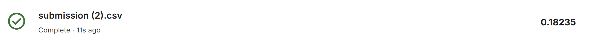
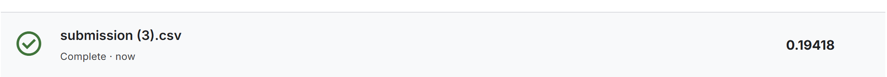
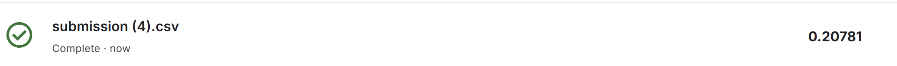
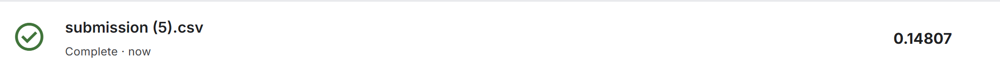

# House-Prices

  გვაქვს სახლის შესახებ სხვადასხვა მონაცემები და შესაბამისად სახლის ფასიც, ჩვენი მიზანია ამ მონაცემების მიხედვით შევქნათ ისეთი მოდელი, რომელიც ახალ შემოსულ სახლის მონაცემებზე დააფრედიქთებს სახლის ფასს. 
თავდაპირველად შევხედე პირველ რამდენიმე row-ს, დავყავი ტრეინ და ტესტ სეტებად. დავიწყე missing value-ების შევსებით.
  I მოდელი : პირველ ჯერზე ვცადე ასეთი მიდგომა, რომ ისეთ სვეტებს, სადაც 80%-ზე მეტი მნიშვნელობა იყო მისინგი დავდროპე. შემდეგ გამოვყავი დარჩენილი მისინგ ქოლუმნებიდან კატეგორიული და არაკატეგორიული სვეტები(features). კატეგორიულები შევავსე მოდით ამ ეტაპზე, float type feature-ებს კიდე ცალ-ცალკე გადავყევი, MasVnrArea-ს განაწილება რო ვნახე არასიმეტრიული განაწილება ქონდა და ამიტომ მედიანით შევავსე, იმიტორო საშუალოზე უკეთეს შედეგს მედიანა მოგვცემს. GarageYrBlt-საც არასიმეტრიული განაწილება აქ და პირველ მოდელში ესეც მედიანით შევავსე ან ვცდი კიდე 0-ების შევსებით, იმიტორო ამ ცვლადში null მნიშვნელობა შეიძლება ნიშნავდეს რო უბრალოდ არ აქვს გარაჟი და არ აშენებულა და ამიტო ასე შევსებაც გასათვალისწინებელია. LotFrontage-ზე საშუალოსაც ვცდი, მედიანასაც და 0-საც, ამჯერად საშუალოთი ვავსებ. 
  მერე გადავედი კატეგორიულების ჰენდლინგზე და სრეშოლდად ავიღე 3 და კატეგორიულ ცვლადს სრეშოლდის ტოლი ან ნაკლები unique value თუ ქონდა one-hot-ს ვუკეთებდი, თუარადა woe. woe ამ შემთხვევაში ორად დავყავი, თარგეთის მედიანა ავიღე სრეშოლდად. 
  ამის მერე კატეგორიულები მოგვარებული იყო და გადავედდი კორელაციის ფილტრზე და თუ 80%-ზე მეტი იყო კორელაცია ეგეთები გავფილტრე და ამან გამიფილტრა 6 ცვლადი. 73 ცვლადი დამრჩა და ბოლოს გავუშვუ RFE რო დამეტოვებინა 15 საუკეთესო ცვლადი, ამ რიცხვსაც ვცდი ცოტა მეტს და ცოტა ნაკლებსაც და ვნახავ უკეთესი შედეგი სად ექნება. 
  პირველ ჯერზე უბრალოდ წრფივი რეგრესია გავუშვი, k_fold cross_validation გამოვიყენე და თითოეულზე ფოლდზე დათვლილი ერორის საშუალო ავიღე და მივიღე 0.2813185564503428, მერე ჩემივე დაყოფილ ტესტ სეტზე გავუშვი და 0.1787106432056241(Result_on_test_set  ქვია) მივიღე, როგორც ვისაუბრეთ, სავარაუდოდ ცოტა მონაცემის ბრალია ასეთი აცდენა. საბოლოოდ საბმიშენზე რო გავუშვი მივიღე ეს შედეგი, რაც საკმაოდ ახლოსაა ჩემს ტესტ სეტზე მიღებულ შედეგთან.

(image.png)

II მოდელი : ახლა, ისევ წრფივ რეგრესიაზე გავუშვებ, ოღონდ ამჯერად შევცვლი პრეპროცესინგის ნაწილში მისინგების შევსებას. ზედა მოდელისგან განსხვავებით, GarageYrBlt ცვლადს მედიანის ნაცვლად ვავსებ 0-ებით, LotFrontage-ს მედიანით საშუალოს ნაცვლად. ამ მცირე ცვლილებამ, როგორც მოსალოდნელი იყო დიდი ვერაფერი ცვლილება მოგვცა. ვალიდაციაზე ისევ უარესი შედეგი ქონდა (0.279) ვიდრე ჩემს ტესტზე(0.176). მეორე მიდგომაში RFE-ს მერე ორი სხვა ცვლადი დამიტოვა წინასთან შედარებით. 

შედეგი იგივე ქონდა, რაც მოსალოდნელი იყო, იმიტორო დიდი ცვლილება არ გამიკეთებია. 

III მოდელი : ამ მოდელში ყველა კატეგორიული მისინგი შევავსე მოდით და არაკატეგორიული მედიანით. ასევე one-hot_ის სრეშოლდი ავწიე 4_ზე, ანუ 4_ზე ნაკლები ან ტოლ unique მნიშვნელობის ცვლდაებს გადააქცევს one-hot_ით და კიდე k_fold_ს აღარ ვიზამ და პირდაპირ გავუშვებ მოდელს. კორელაციის სრეშოლდიც შევცვალე და 0.9-ზე ავწიე. აქ როგორც ვნომრავ მოდელებს მასე მაქ ლოგებშიც, _v3 ამ მოდელის შესაბამისი ლოგებია. ტრეინზე 0.177 ქონდა, რაც ზედა მოდელებისგან განსხვავებით საკმაოდ კარგი შედეგია, ანუ KFold-ის გარეშე უკეთ ქნა. ტესტზე 0.183 რაც ისევ არ არის ამოვარდნილი და ასე თუ ისე სამივე მოდელს მსგავსი შედეგები აქვთ. საბმიშენზეც არ მივიღე ძაან განსხვავებული პასუხი : 

ეს მცირედრით გაუარესება სავარაუდოდ გამოწვეულია კატეგორიულების ესე ყველას ერთნაირად შევსებით და არა ისე, როგორც ზევით ვავსებდი, ცალკე რო დავაკვირდი ზოგიერთ ცვლადს. 

IV მოდელი : ამ შემთხვევაში ვცდი ხის მოდელებს. პირველი Decision tree-ს. მისინგების ჰენდლინგს ისე ვიზამ როგორც პირველ მოდელში, რადგან შედარებით უკეთესი შედეგი ჰქონდა. ამიტო თავიდან აღარ დავლოგავ, იგივე იქნება რაც პირველის ქლინინგი. რაც შეეხება კატეგორიულების ჰენდლინგს, ეგეც მსგავსი იქნება წინების. კორელაციის ფილტრს არ ვიზამ და RFE-იანიც ვცადე და მაგის გარეშეც და გარეშე უკეთესი შედეგი ჰქონდა ჩემს ტესტ სეტზე ამიტომ მაგას გავუშვებ საბმიშენზეც. 0.194 ჰქონდა ჩემს სეტზე და 0.207 საბმიშენზე : 

V მოდელი: ბოლოს ვცდი Random Forest-ს. წინა მოდელისგან ისს განსხვავებაა უბრალოდ,რო რენდომ ფორესტს ვიყენებ. RFE-თ 0.157 მივიღე, მაგის გარეშე 0.146. აქაც გამოჩნდა, რო RFE-ის გარეშე უკეთესი შედეგი უნდა იყოს, ამიტომ საბმიშენზე მაგას გავუშვებ. საბმიშენზე ოდნაც მეტი დაჯდა რა : 

ხოო ნუ გამოჩნდა რო რენდომ ფორესტს ყველაზე კაი შედეგი გამოუვიდა რა ამ მოდელებისგან, XGBoost-ს უკეთესი ექნებოდა სავარაუდოდ, მარა აღარ მიქნია ეგ. 

